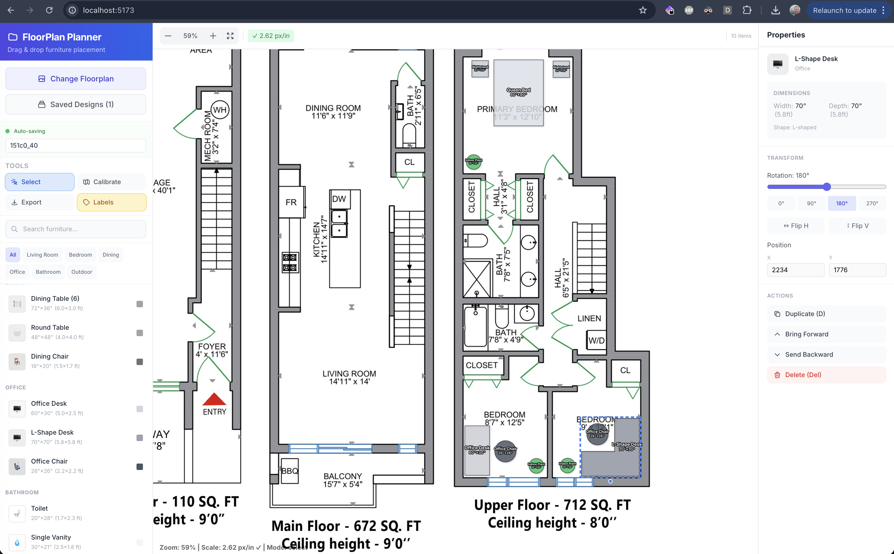

# Floorist

A simple, intuitive web application for planning furniture layouts on your floorplans.



## Features

- **Upload Floorplans**: Upload your own floorplan images (JPG, PNG, SVG).
- **Furniture Palette**: Choose from a variety of furniture pieces (beds, sofas, tables, etc.).
- **Drag & Drop**: Easily place and move furniture on your floorplan.
- **Save & Load Designs**: Save your designs locally and reload them later.
- **Export**: Export your final layout as an image.

## Tech Stack

- [React](https://reactjs.org/)
- [Vite](https://vitejs.dev/)
- [Tailwind CSS](https://tailwindcss.com/)
- [TypeScript](https://www.typescriptlang.org/)

## Getting Started

1. Install dependencies:
   ```bash
   yarn install
   ```

2. Start the development server:
   ```bash
   yarn dev
   ```

3. Build for production:
   ```bash
   yarn build
   ```
